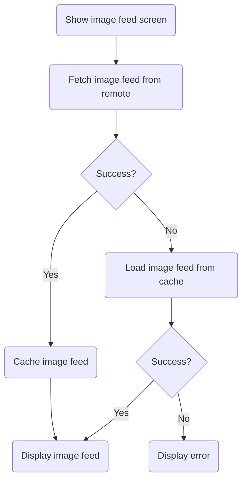
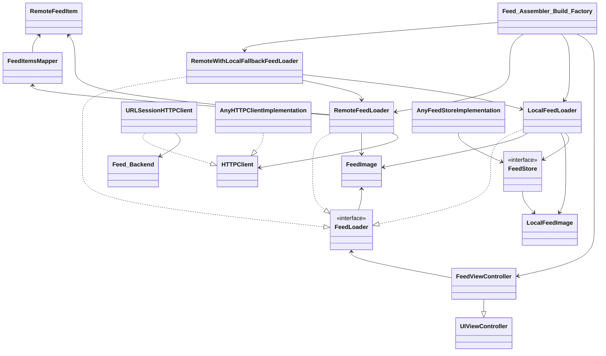

# Flowchart

```mermaid
graph TD
  show(Show image feed screen)
  fetch(Fetch image feed from remote)
  success{Success?}
  cache(Cache image feed)
  display(Display image feed)
  load(Load image feed from cache)
  success2{Success?}
  displayError(Display error)
  show-->fetch
  fetch-->success
  success-->|Yes|cache
  success-->|No|load
  cache-->display
  load-->success2
  success2-->|Yes|display
  success2-->|No|displayError
```

# Architecture

```mermaid
classDiagram

class FeedLoader { <<interface>> }
class FeedStore { <<interface>> }

FeedImage <-- FeedLoader
RemoteFeedLoader ..|> FeedLoader
RemoteFeedLoader --> FeedImage
FeedItemsMapper <-- RemoteFeedLoader
RemoteFeedItem <-- FeedItemsMapper
RemoteFeedItem <-- RemoteFeedLoader
RemoteFeedLoader --> HTTPClient
URLSessionHTTPClient ..|> HTTPClient
AnyHTTPClientImplementation ..|> HTTPClient
URLSessionHTTPClient --> Feed_Backend
RemoteWithLocalFallbackFeedLoader ..|> FeedLoader
RemoteWithLocalFallbackFeedLoader --> RemoteFeedLoader
RemoteWithLocalFallbackFeedLoader --> LocalFeedLoader
LocalFeedLoader ..|> FeedLoader
LocalFeedLoader --> FeedImage
LocalFeedLoader --> LocalFeedImage
LocalFeedLoader --> FeedStore
FeedStore --> LocalFeedImage
AnyFeedStoreImplementation --> FeedStore
FeedLoader <-- FeedViewController
FeedViewController --|> UIViewController
Feed_Assembler_Build_Factory --> RemoteWithLocalFallbackFeedLoader
Feed_Assembler_Build_Factory --> RemoteFeedLoader
Feed_Assembler_Build_Factory --> LocalFeedLoader
Feed_Assembler_Build_Factory --> FeedViewController
```
