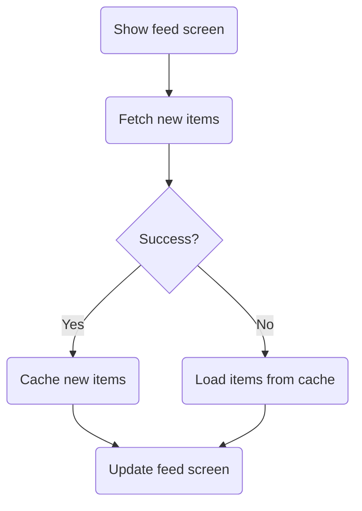
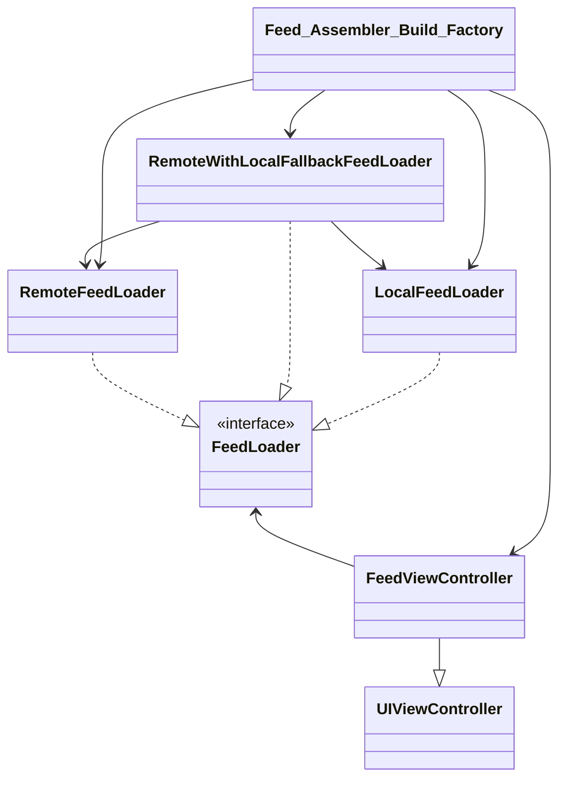

# Essential Feed

Demo project created per taking the Essential Developer Academy course.

# Use Cases

## Load Feed Use Case

### Data (Input):

- URL

### Primary course (happy path):

1. Execute "Load Feed Items" command with above data.
2. System downloads data from the URL.
3. System validates downloaded data.
4. System creates feed items from valid data.
5. System delivers feed items.

### Invalid data – error course (sad path):

1. System delivers error.

### No connectivity – error course (sad path):

1. System delivers error.

## Load Feed Fallback (Cache) Use Case

### Data (Input):

- Max age

### Primary course (happy path):

1. Execute "Retrieve Feed Items" command with above data.
2. System fetches feed data from cache.
3. System creates feed items from cached data.
4. System delivers feed items.

### No cache course (sad path):

1. System delivers no feed items.

------

## Save Feed Items Use Case

### Data (Input):

- Feed items

### Primary course (happy path):

1. Execute "Save Feed Items" command with above data.
2. System encodes feed items.
3. System timestamps the new cache.
4. System replaces the cache with new data.
5. System delivers a success message.

# Flowchart

# Architecture

