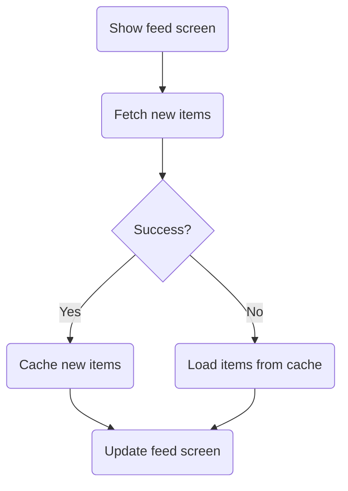
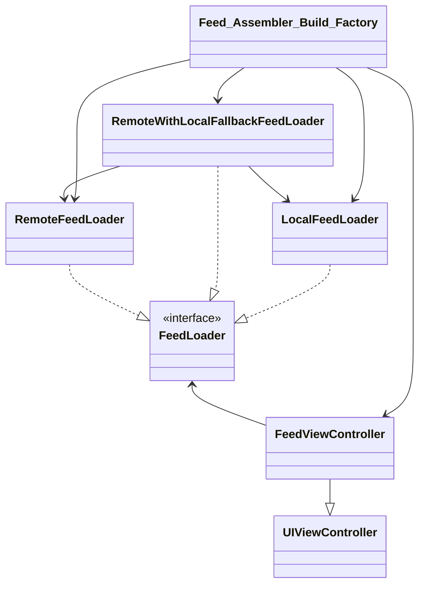

# Essential Feed

Demo project created per taking the Essential Developer Academy course.

# Use Cases

## Load Feed From Remote Use Case

### Data (Input):

- URL

### Primary course (happy path):

1. Execute "Load Feed Items" command with above data.
2. System downloads data from the URL.
3. System validates downloaded data.
4. System creates feed items from valid data.
5. System delivers feed items.

### Invalid data – error course (sad path):

1. System delivers invalid data error.

### No connectivity – error course (sad path):

1. System delivers connectivity error.

## Load Feed From Cache Use Case

### Data (Input):

- Max age (7 days)

### Primary course (happy path):

1. Execute "Load Feed Items" command with above data.
2. System fetches feed data from cache.
3. System validates cache is less than seven days old.
4. System creates feed items from cached data.
5. System delivers feed items.

### Error course (sad path):

1. System delivers error.

### Expired cache course (sad path):

1. System deletes the cache
2. System delivers no feed items.

### Empty cache course (sad path):

1. System delivers no feed items.

------

## Cache Feed Use Case

### Data (Input):

- Feed items

### Primary course (happy path):

1. Execute "Save Feed Items" command with above data.
2. System deletes old cache data.
3. System encodes feed items.
4. System timestamps the new cache.
5. System saves new cache data.
6. System delivers a success message.

### Deleting error course (sad path):

1. System delivers error.

### Saving error course (sad path):

1. System delivers error.

# Flowchart

# Architecture

